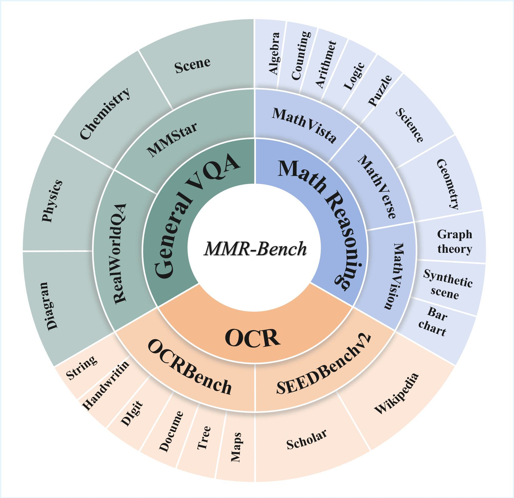
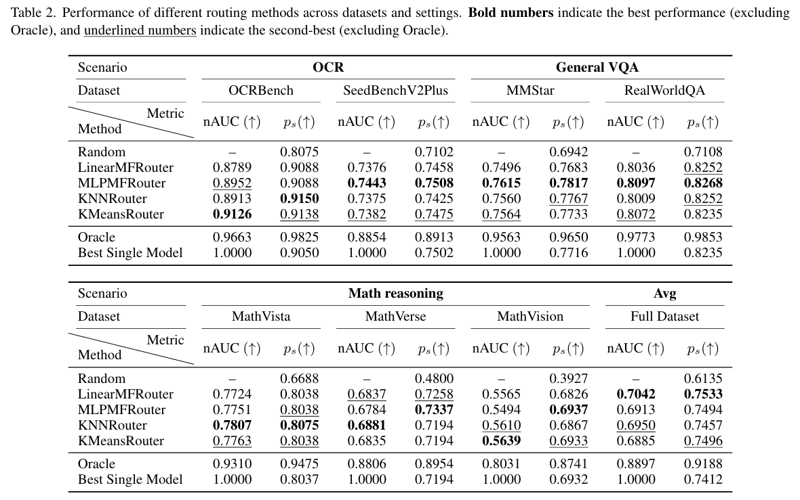
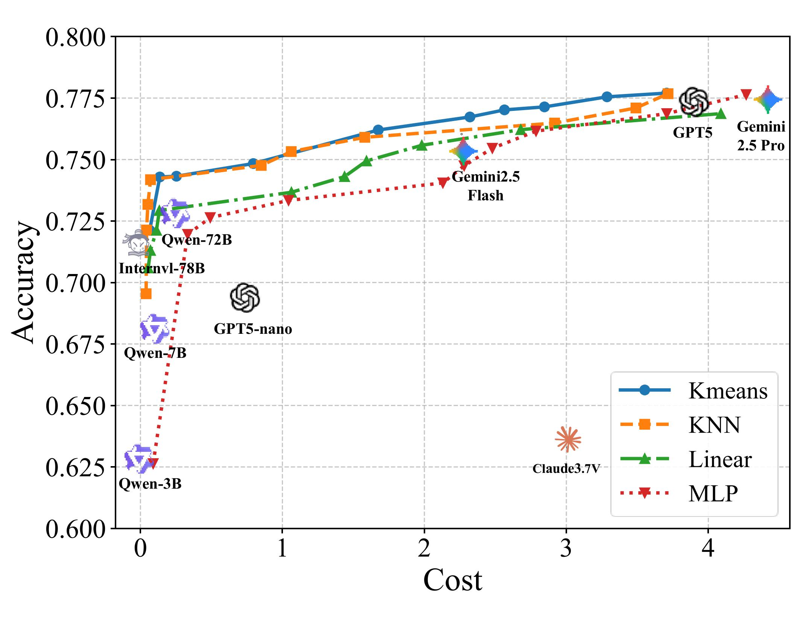
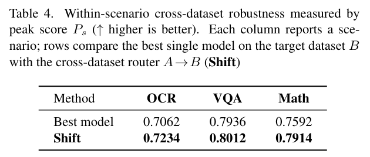
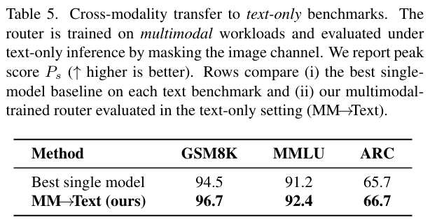

# MMR-Bench: A Comprehensive Benchmark for Multimodal LLM Routing

> **Status:** The full source code and evaluation pipeline will be released soon.  
> This repository currently provides benchmark figures and high-level results for reference.

---

## Overview

MMR-Bench is a comprehensive benchmark designed to evaluate **multimodal LLM routing** under diverse settings.  
It supports systematic comparison across scenarios and provides analysis beyond single-dataset evaluation (e.g., cost–accuracy trade-offs, cross-dataset generalization, and modality transfer).

  

---

## Comparison with Existing LLM Routing Benchmarks

  

---

## Results

### Main Comparisons

  

### Cost–Accuracy Pareto Frontiers on MMR-Bench

  

### Within-Scenario Cross-Dataset Generalization

  

### Cross-Modality Transfer to Text-Only Benchmarks

  

---

## Citation

If you find MMR-Bench useful, please consider citing our paper