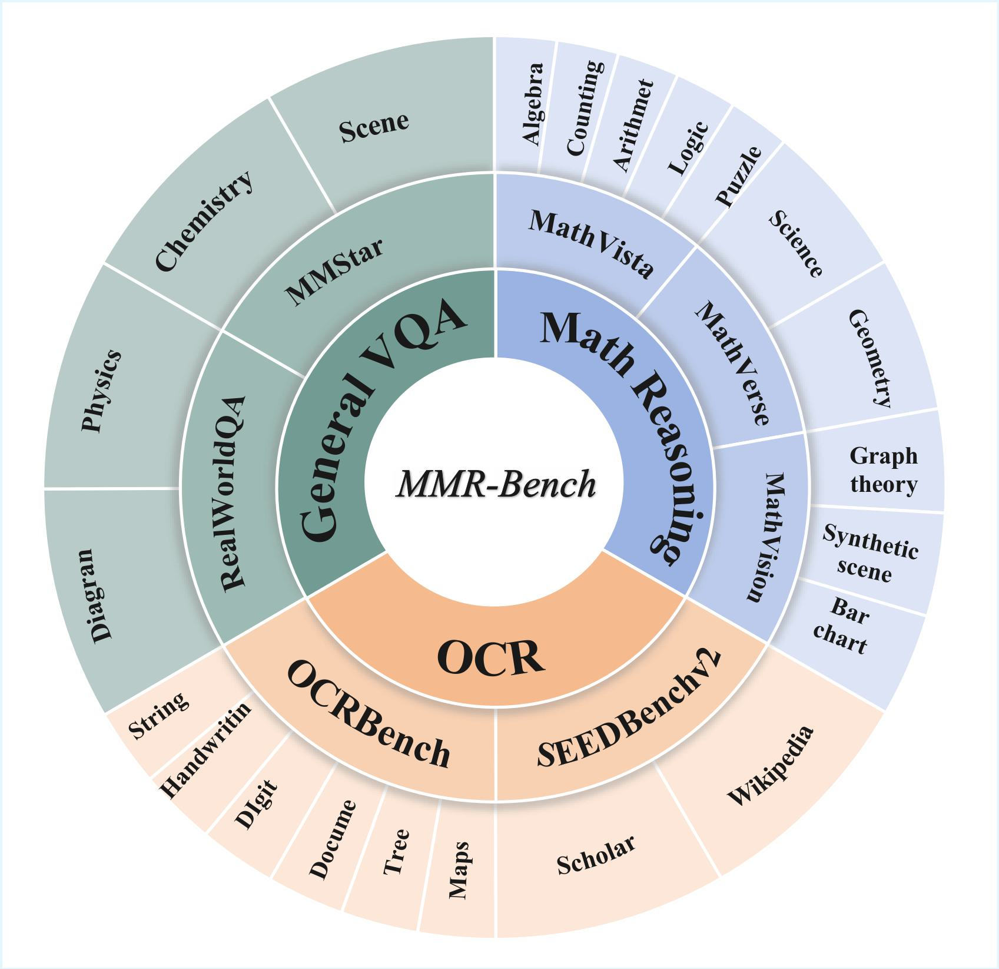
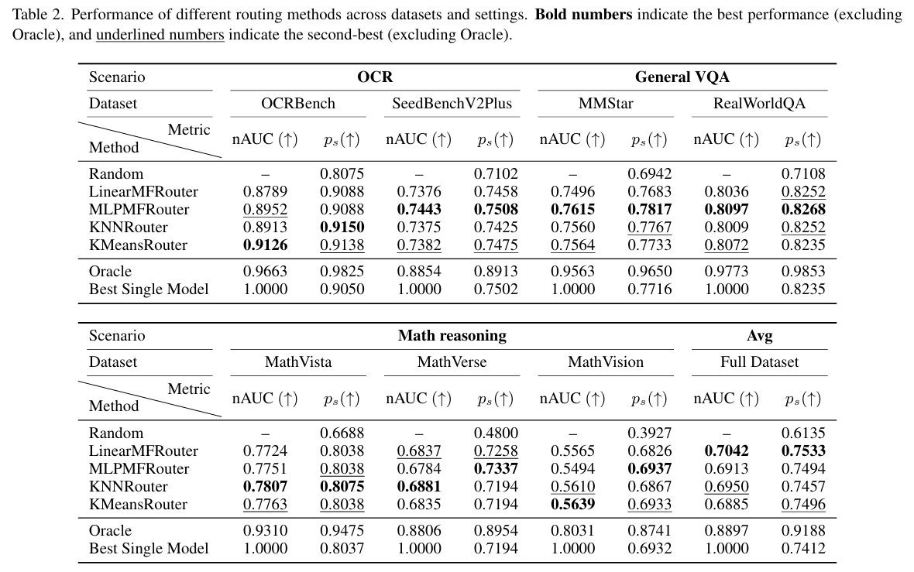

# MMR-Bench: A Comprehensive Benchmark for Multimodal LLM Routing

<p align="center">
  <strong>A unified benchmark for evaluating accurate, efficient, and generalizable multimodal LLM routers.</strong>
</p>

<p align="center">
  
  <a href="https://huggingface.co/datasets/gh0stHunter/MMR-Bench-V2">
    
  </a>
  <a href="LICENSE">
    
  </a>
</p>

<p align="center">
  <a href="https://huggingface.co/datasets/gh0stHunter/MMR-Bench-V2"><b>Dataset</b></a>
  &nbsp;&bull;&nbsp;
  <a href="#quick-start"><b>Quick Start</b></a>
  &nbsp;&bull;&nbsp;
  <a href="#benchmark-results"><b>Results</b></a>
  &nbsp;&bull;&nbsp;
  <a href="#citation"><b>Citation</b></a>
</p>

## News

- **August 2026 — Accepted to ECCV 2026!** 🎉
- **August 2026 — [MMR-Bench V2](https://huggingface.co/datasets/gh0stHunter/MMR-Bench-V2) is now available on Hugging Face.** V2 expands the benchmark to 18 datasets and 44 multimodal models, with a normalized and reproducible data release.

## Overview

Multimodal LLM routing selects the best model for each incoming request instead of sending every request to a single model. MMR-Bench evaluates this decision under realistic accuracy–cost trade-offs and across diverse visual reasoning tasks.

The benchmark is designed around three questions:

- **Effectiveness:** Can a router improve accuracy while controlling inference cost?
- **Generalization:** Does the routing policy transfer across datasets and task distributions?
- **Modality:** How well do text, image, and joint multimodal representations support routing?

This repository provides the routing baselines and offline evaluation pipeline. The complete benchmark data is distributed separately through [MMR-Bench V2 on Hugging Face](https://huggingface.co/datasets/gh0stHunter/MMR-Bench-V2).

<p align="center">
  
</p>

### What is included

| Component | Description |
|---|---|
| **Benchmark** | 18 datasets spanning general VQA, OCR, document and chart understanding, mathematical reasoning, spatial perception, and hallucination robustness |
| **Routing setting** | Offline, cost-aware model routing with per-instance model outcomes |
| **Baselines** | Random, Oracle, k-NN, K-Means, linear and MLP routers, matrix-factorization variants, and CMR |
| **Evaluation** | Accuracy–cost curves and routing metrics including `nAUC`, `Ps`, and `QNC` |
| **Analysis** | In-distribution evaluation, cross-dataset generalization, and cross-modality transfer |

## MMR-Bench V2

> **Download the latest release:** [🤗 `gh0stHunter/MMR-Bench-V2`](https://huggingface.co/datasets/gh0stHunter/MMR-Bench-V2)

V2 unifies the benchmark into a consistent release with:

- 18 benchmark datasets organized by capability;
- evaluation results covering 44 multimodal models;
- standardized instance metadata and per-model outcomes;
- CSV and normalized Parquet artifacts for downstream analysis;
- manifests, model metadata, checksums, and validation utilities for reproducibility.

The Hugging Face data card documents the current file layout, schemas, coverage, and known issues. Large data artifacts are intentionally hosted there instead of in this Git repository.

## Installation

MMR-Bench requires Python 3.9 or newer.

```bash
git clone https://github.com/Hunter-Wrynn/MMR-Bench.git
cd MMR-Bench
pip install -e .
```

Install the optional embedding dependencies to run CLIP/OpenCLIP and sentence-transformer based routers:

```bash
pip install -e '.[embedding]'
```

To use the Hugging Face download helper, install the `hf` extra:

```bash
pip install -e '.[hf]'
```

## Quick Start

### 1. Run the toy example

Generate a small synthetic benchmark and run a router end to end:

```bash
python scripts/make_toy_data.py
mmrbench \
  --data-root data/toy \
  --dataset toy \
  --mode 22 \
  --router kmeansnew
```

The command writes an accuracy–cost curve to `outputs/` and prints a JSON summary containing `nAUC`, `Ps`, and `QNC`. The equivalent module entry point is `python -m mmrbench`.

### 2. Download MMR-Bench V2

```bash
python scripts/prepare_hf_mmr_bench.py \
  --repo gh0stHunter/MMR-Bench-V2 \
  --dest data
```

You can set `HF_HOME` to choose a different Hugging Face cache directory. See [`data/README.md`](data/README.md) and the [V2 data card](https://huggingface.co/datasets/gh0stHunter/MMR-Bench-V2) for the complete layout.

### 3. Run on benchmark data

Dataset names can be joined with `+` to evaluate a combined routing scenario:

```bash
mmrbench \
  --data-root data \
  --dataset ocrbench+seedbench+mmstar \
  --mode 22 \
  --router linearmf
```

The two digits in `--mode` specify the train and test modalities:

| Value | Modality |
|---|---|
| `1` | Text |
| `2` | Multimodal (text + image) |
| `3` | Image |

For example, `22` evaluates multimodal-to-multimodal routing, while `12` trains with text features and evaluates on multimodal inputs.

## Data Format

MMR-Bench performs offline routing over precomputed model outcomes. At minimum, each instance contains:

- `dataset_idx`: globally unique instance identifier;
- `question`: input question;
- `img_path`: optional path to the associated image;
- `<model>_correct`: per-model outcome or score;
- `<model>_cost`: per-model cost in any consistent unit.

The V2 release additionally retains normalized predictions, token counts, benchmark metadata, and validation status where available. See the Hugging Face data card for the authoritative V2 schema.

## Benchmark Results

### Main comparison

<p align="center">
  
</p>

## Reproducing Results

This codebase focuses on routing algorithms and offline evaluation. To reproduce a run:

1. download the MMR-Bench V2 outcomes and corresponding image data;
2. place or link the data under `data/`;
3. select the dataset combination, modality mode, and router;
4. run `mmrbench` and compare the generated cost–accuracy curve and summary metrics.

Use `--random-state` for deterministic data splits. Router-specific options such as `--n-clusters`, `--knn-k`, `--mf-rank`, and `--epochs` are exposed through the command-line interface.

## Contributing

Contributions to routing methods, benchmark adapters, evaluation, and documentation are welcome. Please see [`CONTRIBUTING.md`](CONTRIBUTING.md) before opening a pull request.

## Citation

If you find MMR-Bench useful, please cite our ECCV 2026 paper. The final BibTeX entry will be added when the proceedings metadata is available.

## License

This repository is released under the [MIT License](LICENSE).
